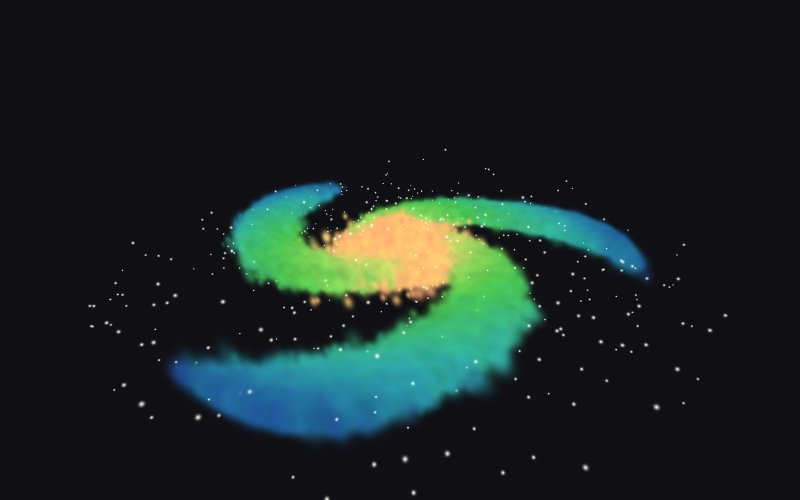

# Splat Gallery

Galeri web statis untuk memajang project **3D Gaussian**. Setiap project tampil sebagai kartu di galeri; klik kartu untuk membukanya di viewer 3D interaktif (putar, geser, zoom).

Situs ini 100% statis dan self-contained jadi bisa di-hosting gratis di GitHub Pages tanpa build step dan tanpa CDN eksternal.



## Struktur

```
index.html            → halaman galeri (grid kartu project)
viewer.html           → viewer 3D bawaan (orbit/pan/zoom)
scenes/index.json     → daftar project yang tampil di galeri
scenes/<id>/          → satu folder per project (file scene + thumbnail)
vendor/playcanvas.mjs → engine PlayCanvas (renderer gaussian splat)
tools/                → script pembuat scene demo
```

## Menjalankan secara lokal

```bash
python3 -m http.server 8000
# buka http://localhost:8000
```

(Harus lewat web server — membuka `index.html` langsung dari file tidak akan jalan karena `fetch`.)

## Menambahkan project baru

1. **Buat / edit scene** di [SuperSplat editor](https://superspl.at/editor) (atau hasil training 3DGS Anda).
2. **Ekspor** dari SuperSplat sebagai **Compressed PLY** (`.compressed.ply`) atau **SOG** — jauh lebih kecil daripada PLY biasa. Bisa juga kompres lewat CLI [splat-transform](https://github.com/playcanvas/splat-transform):
   ```bash
   npx @playcanvas/splat-transform input.ply output.compressed.ply
   ```
3. **Salin** file scene ke folder baru, misal `scenes/rumah-saya/scene.compressed.ply`.
4. **Daftarkan** di `scenes/index.json`:
   ```json
   {
     "id": "rumah-saya",
     "title": "Rumah Saya",
     "author": "Rendra",
     "description": "Scan rumah dengan 3D Gaussian Splatting.",
     "src": "scenes/rumah-saya/scene.compressed.ply",
     "thumbnail": "scenes/rumah-saya/thumbnail.jpg"
   }
   ```
5. **Thumbnail** (opsional): screenshot scene, simpan sebagai `thumbnail.jpg` di folder scene. Tanpa thumbnail, kartu memakai placeholder huruf.
6. Commit & push — selesai.

### Opsi per scene di `index.json`

| Field | Keterangan |
|---|---|
| `src` | Path/URL file `.ply`, `.compressed.ply`, atau `.sog` |
| `camera.position` / `camera.target` | Posisi awal kamera `[x, y, z]`. Tanpa ini, kamera auto-frame dari bounding box |
| `camera.fov` | Field of view (default 60) |
| `rotation` | Rotasi scene `[x, y, z]` derajat — PLY hasil training 3DGS sering terbalik; coba `[180, 0, 0]` |
| `position`, `scale` | Transform tambahan untuk scene |
| `viewerUrl` | Alternatif: link langsung ke paket "HTML viewer" hasil ekspor SuperSplat (taruh di `scenes/<id>/`), melewati viewer bawaan |

## Deploy ke GitHub Pages

1. Di repo GitHub: **Settings → Pages → Source: GitHub Actions**.
2. Merge/push ke branch `main` — workflow `.github/workflows/deploy.yml` otomatis mem-publish situs.
3. Situs tersedia di `https://<username>.github.io/<repo>/`.

> **Catatan ukuran file**: GitHub membatasi 100 MB per file. Gunakan Compressed PLY / SOG (biasanya 10–20× lebih kecil). Untuk scene sangat besar, hosting file scene-nya di tempat lain (misal Cloudflare R2 / Hugging Face) dan isi `src` dengan URL penuh.

## Scene demo

`scenes/demo-galaxy/` berisi galaksi spiral ±35.000 gaussian yang dibuat prosedural — hanya placeholder agar galeri tidak kosong. Regenerasi dengan:

```bash
python3 tools/generate_demo_splat.py
```

Hapus foldernya dan entri-nya di `scenes/index.json` kalau sudah punya scene sendiri.

## Kredit

- [SuperSplat](https://github.com/playcanvas/supersplat) — editor 3D Gaussian Splat
- [splat-transform](https://github.com/playcanvas/splat-transform) — CLI konversi/kompresi splat
- [PlayCanvas Engine](https://github.com/playcanvas/engine) — renderer WebGL/WebGPU (lisensi MIT, lihat `vendor/PLAYCANVAS-LICENSE`)
